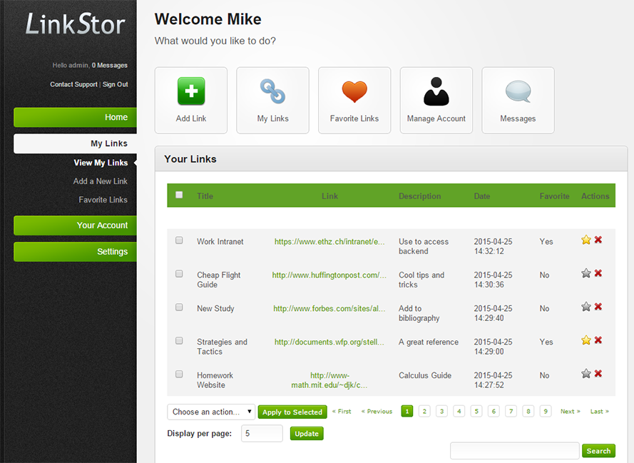
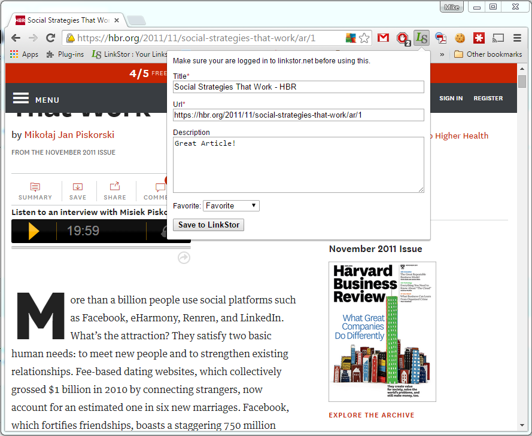

# LinkStor
The on-demand cloud bookmarking service, now open source.

Linkstor was started in 2010 and released in 2011.

It picked up a cult following, and now I'm opening it up to the world.

This was a suprisingly useful tool back in the days when browsers didn't yet sync bookmarks.

Check out a live demo here: http://linkstor.net
(be careful, this demo implementation doesn't have SSL)

## Screenshots:
### UI

### Chrome extension

## TODO:
- Create a mobile responsive design
- Add a link shortner
- Create extensions for other browsers
